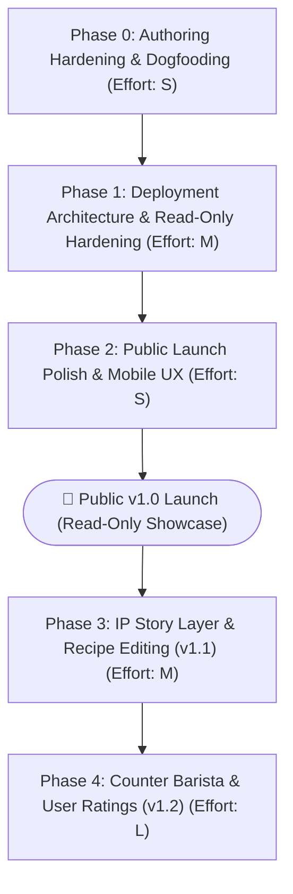

# StickyMilk: Solo-Founder Product Roadmap (v1.0 & Beyond)

*Author: Antigravity & Claude (Reviewed with Tony)*  
*Baseline: September 16, 2026 (18 Kitchen-Tested Recipes, Next.js 16, Tailwind v4, Prisma 7 / SQLite)*

---

## 0. Immediate Next Actions (This Week)

Before kicking off any multi-week phases, execute these two tactical moves to ground decisions in reality and verify the build pipeline:

1. **Dogfood the New Recipe Form with 2 Real Drinks**
   * **Action:** Open `http://localhost:3000/recipes/new` and author two actual drinks from your kitchen end-to-end.
   * **Why now:** You need to experience the tactile friction (unit autocompletes, taxonomy misfires, missing fields) *before* locking the schema or writing an edit flow.
2. **Verify `npm run build` on Your Local Machine**
   * **Action:** Run `npm run build` directly in PowerShell outside any restricted sandbox.
   * **Why now:** `JOURNAL.md` noted that Google Fonts fetching failed inside cloud sandbox containers (`fonts.googleapis.com` firewalled), but standard machines and Vercel have normal internet egress. Confirming this locally tells you whether font bundling is actually needed or already works fine.

---

## 1. Solo-Developer Phases (Dependency-Ordered Roadmap)



---

### Phase 0: Authoring Hardening & Dogfooding
*Objective:* Solidify data integrity and ensure content authoring doesn't corrupt recipe files.  
*Solo Effort:* **S (2–3 days)**

* **Workstreams:**
  * **Design / UX:** Fix minor validation error states on `components/RecipeForm.tsx`; ensure error toasts or field-level highlights clearly communicate taxonomy mismatches.
  * **Engineering:** Implement atomic JSON writes (`fs.writeFileSync` to a temp file, then rename) so an interrupted write or server crash never truncates an existing recipe file.
  * **Content / Editorial:** Run a schema validation audit over all 18 existing JSON files in `content/recipes/` to ensure 100% compliance with `secondary_amount` and `roast_recommendation`.
  * **Infra / Ops:** Initialize a local git repository if not already tracked; commit the verified clean baseline.

> [!IMPORTANT]
> **Phase 0 Exit Gate (Pass/Fail):**
> - [ ] **Tech Gate:** 2 new recipes authored via `/recipes/new` validate against `lib/recipe-schema.ts` and render without runtime errors on `/recipes/[slug]`.
> - [ ] **Content Gate:** Zero schema warnings or missing taxonomy IDs on the 18 seeded recipes.

---

### Phase 1: Deployment Architecture & Read-Only Hardening
*Objective:* Unblock production hosting by decoupling public visitors from local server-side filesystem writes.  
*Solo Effort:* **M (4–5 days)**

* **Workstreams:**
  * **Engineering:** 
    * Verify existing production gating: confirm that `app/recipes/new/page.tsx` (`if (process.env.NODE_ENV === "production") notFound()`) and `lib/actions/create-recipe.ts` continue to reject execution in production builds.
    * Test production build on Vercel; if font fetching is blocked in your CI environment, only then switch `next/font/google` to `next/font/local`.
  * **Design / UX:** Verify responsive layout for mobile viewports on both the homepage left-rail and the recipe detail HUD. On mobile, the left-rail filter panel must collapse cleanly into a toggle drawer or top horizontal chip bar.
  * **Content / Editorial:** Audit image assets in `public/recipes/`; replace any broken image paths or missing fallbacks with the studio SVG placeholder.
  * **Infra / Ops:** Connect repo to Vercel. Set up preview deployments. Confirm `npm run build` passes on Vercel's build container.

> [!IMPORTANT]
> **Phase 1 Exit Gate (Pass/Fail):**
> - [ ] **Tech Gate:** `next build` succeeds with 0 lint, type, or font errors.
> - [ ] **Infra Gate:** App is live on a Vercel staging URL; navigating to `/recipes/new` in production returns a clean 404 rather than an unhandled serverless exception.
> - [ ] **UX Gate:** Mobile audit on real hardware (iOS/Android) confirms the filter sidebar and extraction timer are fully usable.

---

### Phase 2: Public Launch Polish & Metadata
*Objective:* Prepare the site for public traffic, social sharing, and search indexing.  
*Solo Effort:* **S (2–3 days)**

* **Workstreams:**
  * **Design / UX:** Empty state polish—ensure channels with no preparation (e.g., instant on complex drinks) show the honest "Why this channel is unsupported" card without layout shifts.
  * **Engineering:** Dynamic OpenGraph (`og:image`) generator for recipe pages using Next.js `ImageResponse` (rendering the drink title, roast badge, and brutalist framing for social links).
  * **Content / Editorial:** Draft site meta description, canonical URLs, and structured recipe JSON-LD (`schema.org/Recipe`) for rich Google search snippets.
  * **Infra / Ops:** Attach custom domain, verify SSL, configure Vercel Analytics or lightweight privacy-friendly analytics (e.g., Plausible or Cloudflare Web Analytics).

> [!IMPORTANT]
> **Phase 2 Exit Gate (Pass/Fail):**
> - [ ] **Tech Gate:** Lighthouse scores > 95 for Performance, Accessibility, and SEO on desktop/mobile.
> - [ ] **UX Gate:** Shared links on X/iMessage render rich cards with recipe titles and photos.
> - [ ] **Launch Gate:** Custom domain is live.

---

### Phase 3 (v1.1): IP Story Layer & Recipe Editing
*Objective:* Strengthen search presence, legal defensibility, and editorial maintenance.  
*Solo Effort:* **M (1 week)**

* **Workstreams:**
  * **Design / UX:** Add an editorial "Origin / Context" prose section under the recipe title or above the prep steps; build `/recipes/[slug]/edit`.
  * **Engineering:** 
    * Add `story?: string` (Markdown format) to `lib/types.ts`.
    * Build the Edit Recipe workflow (pre-populating the form from JSON). Handle slug renaming (delete old file, write new file, and insert a redirect mapping in `next.config.ts`).
  * **Content / Editorial:** Write narrative stories for the top 5 anchor recipes (cà phê sữa đá, egg coffee, sticky latte, etc.) explaining their cultural lineage and dairy physics.
  * **Infra / Ops:** Script a local data export/backup before executing slug renames.

---

### Phase 4 (v1.2+): Interactive Expansion (Counter Barista & Ratings)
*Objective:* Introduce user-generated input and intelligent recipe recommendation.  
*Solo Effort:* **L (2–3 weeks)**

* **Workstreams:**
  * **Engineering:** 
    * Add recipe-level dairy and flavor facet tags to schema.
    * Build deterministic catalog matcher for `/counter-barista`.
    * Build Gemini/Claude structured output pipeline for untested generative drink builds.
    * Wire up Prisma SQLite/Postgres for community ratings and reviews.
  * **Design / UX:** Standalone "Counter Barista" pantry tool with laboratory styling.

---

## 2. The v1.0 Cut Line

The greatest risk for a solo developer is delaying launch for features that visitors don't require on day one.

| Feature / Workstream | Status in v1.0 | Rationale for Cut Line |
| :--- | :--- | :--- |
| **Read-Only Recipe Archive** | **MUST HAVE (In)** | Core product value. Translation across Cometeer/Nespresso/Instant. |
| **0.5x – 4x Metric Scaler** | **MUST HAVE (In)** | Differentiator. Already built and verified. |
| **Extraction Chronometer** | **MUST HAVE (In)** | Built into `components/RecipeDetail.tsx`. Essential to lab aesthetic. |
| **Mobile-Responsive Filters** | **MUST HAVE (In)** | 70%+ of consumer food/drink traffic is mobile. |
| **Production Gate Verification** | **MUST HAVE (In)** | Verify `/recipes/new` and `createRecipeAction` remain dead in prod. |
| **Dynamic OpenGraph Cards** | **MUST HAVE (In)** | Essential for recipe sharing and traffic acquisition. |
| **Offline Font Bundling** | **CONDITIONAL** | Only required if your production build environment is network-restricted. |
| **Recipe Editing Flow (`/edit`)** | **CUT (Defer to v1.1)** | You have 18 recipes. Hand-editing or deleting and re-creating via `/recipes/new` works locally for a solo author. |
| **Auth / Admin Login** | **CUT (Defer to v1.1+)** | Local authoring means machine access is your auth. `/recipes/new` is 404'd in production. |
| **Rich-Text "Story" Markdown** | **CUT (Defer to v1.1)** | Recipes are functional and honest today. Add stories post-launch for SEO iterations. |
| **Counter Barista (AI Tool)** | **CUT (Defer to v1.2)** | High complexity, requires structured LLM integration and facet tagging. |
| **Prisma `User` / `Rating` UI** | **CUT (Defer to v1.2)** | Empty review sections look abandoned on small launches. |
| **Promo / Affiliate Engine** | **CUT (Defer to v1.2+)** | Zero traffic = zero affiliate revenue. Build traffic first. |

---

## 3. Critical Architectural & Product Decision Forks

### Fork 1: The Vercel Serverless File System Trap
* **The Problem:** Next.js Server Actions running on Vercel cannot write to `content/recipes/*.json`. Attempting to do so triggers `EROFS: read-only file system`.
* **The Options:**
  1. *Migrate everything to a Database (Postgres/Supabase)*: Eliminates git diffs, requires auth, destroys the simple local file workflow.
  2. *GitHub Commit API*: The form commits back to GitHub via REST API, triggering a Vercel redeploy. (High complexity, slow feedback loop, rate limits).
  3. *Local-First Editorial + Git Push (Recommended for v1.0)*: The app is purely static/read-only in production. You author recipes on your machine (`localhost:3000/recipes/new`), inspect the git diff, commit, and push. Vercel automatically deploys.
* **The Verdict:** **Option 3 is already active.** Both `app/recipes/new/page.tsx` and `lib/actions/create-recipe.ts` already gate execution when `process.env.NODE_ENV === "production"`. Maintain this architecture for v1.0.

### Fork 2: Authoring & Auth Timing
* **The Decision:** When does auth actually become a blocker?
* **The Verdict:** Auth is **completely unnecessary for v1.0**. Because authoring stays on your local development machine, physical access to your machine *is* your authentication. You do not need NextAuth/Clerk/Lucia until you either:
  1. Invite a second collaborator who cannot use Git, or
  2. Allow public visitors to leave star ratings.

### Fork 3: The IP / Legal Story Layer
* **The Decision:** When and how to build the Markdown recipe story.
* **The Legal Reality:** Pure lists of ingredients and mechanical brew instructions cannot be copyrighted under US law (they are functional facts). Narrative background, cultural history, sensory descriptions, and personal notes *are* copyright-protected expression.
* **The Implementation:** Do not install a heavy WYSIWYG editor (like TipTap or Slate) which complicates the JSON format. Add an optional `story?: string` field to `lib/types.ts`, write standard Markdown in a plain `<textarea>`, and render it with a lightweight component like `react-markdown`.

### Fork 4: Counter Barista Prerequisites
* **The Decision:** What must exist before building the AI pantry tool?
* **The Hard Blockers:**
  1. *Facet Normalization:* Today, dairy is an ingredient line (`sweetened condensed milk` with category `dairy`). Counter Barista needs a top-level drink facet (e.g., `dairy_profile: "heavy_condensed" | "light_foam" | "dairy_free"`).
  2. *LLM Schema Pipeline:* You cannot send freeform text prompts to an LLM; it must use structured outputs (`zodResponseFormat` or tool-calling) validated directly against `lib/recipe-schema.ts` so generated builds match your format standards.

---

## 4. Known Ambiguities & Blockers to Resolve

1. **Destructive Slug Renames:**
   * In `components/RecipeForm.tsx`, changing a recipe's name changes its slug. If an edit flow writes `content/recipes/${newSlug}.json`, the old file remains on disk as an orphan unless explicitly deleted, which breaks external URLs.
   * *Resolution:* Store an explicit `original_slug` hidden field; if `slug !== original_slug`, delete the old file and add a 301 redirect.
2. **In-Memory Cache Invalidation:**
   * `lib/recipes.ts` uses a module-level variable `let cache: Recipe[] | null = null;`. In local dev, hand-editing a file directly requires restarting `next dev` because the cache does not watch disk events (though the New Recipe form calls `invalidateRecipeCache()` automatically).
   * *Resolution:* In development (`process.env.NODE_ENV === "development"`), bypass the cache or re-read disk on every request.
3. **Sandbox vs. Production Environment Confusions:**
   * Do not mistake container sandbox limitations (like firewalled Google Fonts requests) for production hosting bugs. Always verify build behaviors on your host machine or in a live Vercel preview before adding local polyfills.

---

## Summary Timeline

```
Week 1: Dogfood /recipes/new (2 recipes) ➔ Verify `npm run build` on host machine
Week 2: Mobile responsive polish ➔ Verify prod 404-gate ➔ Deploy to Vercel staging
Week 3: Dynamic OpenGraph cards ➔ Domain & SEO setup ➔ 🚀 Public v1.0 Launch
--- Post-Launch ---
Week 4+: Recipe edit flow ➔ Markdown story field (v1.1)
Week 6+: Counter Barista pantry matcher (v1.2)
```
